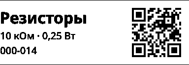
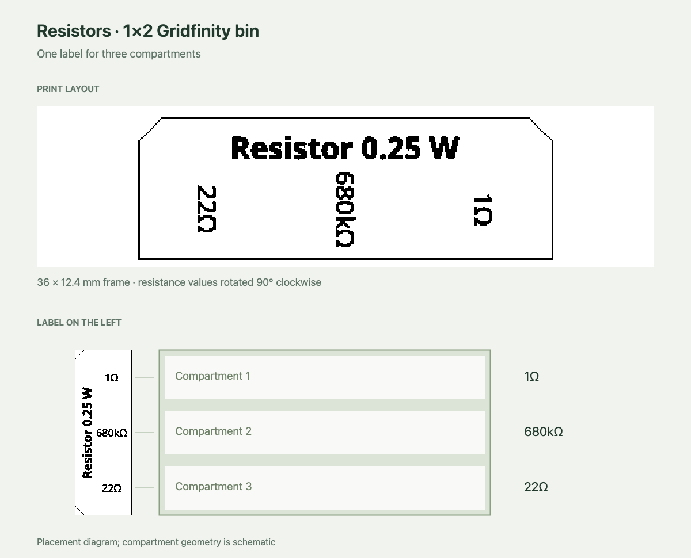

# JSON label template

The page accepts a single JSON document in the URL fragment:

```ts
const hash = '#template=' + encodeURIComponent(JSON.stringify(template));
```

The project provides `encodeTemplateHash()` and `decodeTemplateHash()` in
`src/lib/label/template.ts` for this. The fragment is not sent to the HTTP server.
The old `#bytemap=…` format has been removed: those links display an error and
disable printing.

## Structure

```json
{
	"version": 1,
	"width": 384,
	"height": 115,
	"layers": [
		{
			"type": "text",
			"x": 16,
			"y": 12,
			"width": 200,
			"height": 40,
			"text": "Resistors",
			"fontSize": "auto",
			"fontWeight": 700
		},
		{
			"type": "text",
			"x": 16,
			"y": 56,
			"width": 200,
			"height": 30,
			"text": "10 kΩ · 0.25 W",
			"fontSize": 15
		},
		{
			"type": "qr",
			"x": 236,
			"y": 8,
			"size": 99,
			"text": "HTTPS://HB.JJFF.CLOUD/A/000014",
			"errorCorrection": "L",
			"rotation": 270
		}
	]
}
```

The complete example **with a PNG frame**, three lines, and a QR code is in
[`src/lib/label/example.json`](../src/lib/label/example.json). The “Show example”
button opens it. Copy the JSON to change the text and QR content.

All dimensions and coordinates are **printer dots**, not CSS pixels in the
preview. The origin is the top-left corner; `x` increases to the right, `y`
downward. At 203 dpi, one dot is approximately 0.125 mm. The canvas starts white.
Layers are drawn in array order, from first to last.

The root fields `version`, `width`, `height`, and `layers` are required. Dimensions
and coordinates are integers. Each block must fit entirely within the canvas.
Unknown versions, layer types, and fields are rejected so a typo cannot silently
change the printout. An empty layer array produces a white canvas.

## Layers

| Type    | Required fields                                 | Optional fields                                     |
| ------- | ----------------------------------------------- | --------------------------------------------------- |
| `image` | `x`, `y`, `width`, `height`, `src`              | —                                                   |
| `text`  | `x`, `y`, `width`, `height`, `text`, `fontSize` | `fontWeight`, `align`, `rotation`                   |
| `qr`    | `x`, `y`, `size`, `text`                        | `errorCorrection`, `rotation`, `quietZone`, `align` |

### Image

`src` is a PNG embedded as `data:image/png;base64,…` (standard Base64 with `+`, `/`,
and trailing `=` padding). The layer is scaled to the specified rectangle without
smoothing. PNG transparency is preserved; opaque pixels cover previous layers.
External URLs and SVG are not supported: the template contains the entire image
and requires neither a download from another site nor CORS configuration.

### Text

One layer is one line, including an empty line. Line breaks are not supported:
add a separate layer for each line.

- `fontSize` is required: either a number from 1 to 256 (fractional values are allowed)
  or `"auto"`.
- A numeric size is applied as given; content outside the block is clipped.
- `"auto"` selects the largest whole-dot font size from 1 to 256 that fits both the
  block's width and height. It measures the loaded font, including glyph overhangs,
  accents, and the font's line height. Short lines can grow; long lines shrink.
  If the line cannot fit even at size 1, rendering reports a dimensions error.
  Empty lines remain blank. Text does not wrap in either mode.
- `fontWeight`: `400`, `500`, or `700`; defaults to `400`.
- `align`: `left`, `center`, or `right`; defaults to `left`.
- The line is vertically centered in its block.
- `rotation`: a clockwise rotation of `0`, `90`, `180`, or `270` degrees; defaults
  to `0`. The block coordinates and dimensions describe the **final** rectangle
  on the canvas. At `90` or `270`, text is fitted into a line area whose width and
  height are swapped, then rotated about the block center. Alignment is relative
  to the line before rotation; clipping rotates with it.
- Text is black. The application bundles **Noto Sans Variable**, including Cyrillic.
  Rendering waits for the font to load before enabling printing.

HTML, CSS, and variable substitutions in `text` are not evaluated. The program
creating the link must substitute the required Homebox or other source values in
advance.

### QR

`text` is passed to the encoder unchanged. `size` defines a square including the
quiet zone on each side. `quietZone` is a non-negative integer measured in modules
and defaults to `4`. Set it to `0` when surrounding whitespace provides the quiet
zone, such as the unprintable paper margin beside an edge-aligned QR code.
The encoder selects the smallest suitable
version and an integer number of dots per module, then centers the code in the
square. There is no fractional scaling or smoothing. If even one pixel per module
will not fit, the template reports an error.

`errorCorrection` is `L`, `M`, `Q`, or `H`; defaults to `M`.
`align` is `left`, `center`, or `right`; defaults to `center`. It controls the
horizontal placement of the matrix within the square, retaining the requested
quiet zone at the aligned edge. Vertical placement remains centered. With
`quietZone: 0` and `align: "right"`, the last matrix column reaches the right edge
even when a replacement URL changes the QR version or module size.
`rotation` is a clockwise rotation of `0`, `90`, `180`, or `270` degrees; defaults
to `0`. The QR layer draws black modules; its remaining pixels are transparent.

## Matching the Swift label

The example is based on `GridfinityLabel.swift`, `GridfinityLabelTextRenderer.swift`,
and `HomeboxItemLink.swift` from the neighboring `peripage` project:

- A 384×115 canvas, a 288×99 frame starting at `(48, 8)`, 16-dot top bevels,
  square bottom corners, and a one-dot outline. The frame was converted to PNG
  without smoothing.
- Three independent text lines on the left, with sizes **24, 15, 15** set in the JSON.
- A 99×99 QR code at `(236, 8)`, error correction `L`, rotation `270`: the corner
  without a finder pattern is at the top right. The short URL
  `HTTPS://HB.JJFF.CLOUD/A/000014` produces a 25×25 matrix with 3×3-dot modules.

The browser uses Noto Sans, while Swift used the system AppKit font, so the glyphs
are not bit-for-bit identical. The example keeps fixed sizes; set any text layer's
`fontSize` to `"auto"` to fit replacement text within the same block.
The Homebox API, credentials, and field selection logic are outside this format's
scope.

## Homebox at full printable width

[`src/lib/label/homebox-full-width.json`](../src/lib/label/homebox-full-width.json)
is an additional Homebox layout with a **384×132** canvas (approximately
48×16.5 mm at 203 dpi). It scales the original 288×99 label area by **4/3** to
fill the A6's 384-dot printable width. The original canvas's white outer margins
are removed: coordinates are measured from the original frame origin `(48, 8)`
before scaling, then rounded to whole dots.

The text and QR modules are enlarged proportionally. Fixed font sizes are
**32, 20, 20**. The text blocks start at **x = 0** and extend to `x = 244`.
The QR matrix is **100×100**, at **(268, 16)**, with its rightmost column
at `x = 367`. The example URL still produces 25×25 modules at 4×4 dots each,
retaining error correction `L`, rotation `270`, and the uppercase Homebox URL.
Its `quietZone: 0` removes the embedded white border, and `align: "right"` keeps
replacement QR values aligned to that same column. The current printer and tape
produced measured paper margins of **3.2 mm on the left** and **1.2 mm on the right**
when both sides of the content reached the canvas edges. A **16-dot right inset**
(approximately **2 mm** at 203 dpi) compensates for this difference, giving
expected content margins of approximately **3.2 mm on both sides**. The text
still starts at the left canvas edge. Whitespace within the layout and on the
paper surrounds the QR. Vertical positions and font sizes are preserved.
As with the original, use `fontSize: "auto"` if replacement text should fit its block.

The background contains only two horizontal cut lines across the full width,
at `y = 0` and `y = 131`. Each remains **one dot thick**. There are no vertical
lines or beveled corners. The PNG is embedded at its native 384×132 resolution,
so image scaling cannot thicken the lines. Only the top and bottom need trimming.



To create a link, import this JSON instead of `example.json` in the example below.
The original Homebox and resistor templates remain available separately.

## Resistors in a three-compartment Gridfinity bin

[`src/lib/label/resistors.json`](../src/lib/label/resistors.json) uses the same
384×115 canvas and 288×99 beveled frame (approximately 36×12.4 mm at 203 dpi).
It contains a centered, auto-sized `Resistor 0.25w` heading and three equal-width
blocks with regular `18`-dot nominal text (`fontWeight: 400`), rotated `90` degrees clockwise.

The printed order is `22Ω`, `680kΩ`, `1Ω` from left to right. Mount the label
on the left of a horizontal 1×2 bin, rotated `90` degrees **counter-clockwise**:
the nominal text then reads horizontally, `1Ω`, `680kΩ`, `22Ω` from top to
bottom. This assumes three compartments per bin. The heading runs vertically
along the outer edge. Change the four text layers to reuse the layout.



[`resistor-label/print.png`](resistor-label/print.png) is the full 384×115
monochrome print raster, exported from the application's preview using
[`resistor-label/template.en.json`](resistor-label/template.en.json). The
documentation images use the heading `Resistor 0.25 W`. The placement diagram
is schematic; it does not establish the dimensions of a physical bin or
its label holder. Load the JSON with `encodeTemplateHash()` as for the Homebox
example. The existing example button still opens the Homebox label.

## Preview and printing

The canvas composition is converted to a monochrome raster with a brightness
threshold of `0.82`, matching Swift. Rows run from top to bottom; the most significant
bit in a byte is the leftmost pixel, and `1` means black. Unused bits on the right
remain white. **The preview displays the same bytes passed to the printer client.**

Printing is disabled while the font or PNG is loading. An error clears the previous
raster. If the link changes during loading, a late result cannot replace the new
template. The print button keeps its existing behavior: connect first if necessary,
then send the prepared raster.

Limits: 4096 dots per side, 1,048,576 dots per canvas and source PNG, 64 layers,
262,144 UTF-16 code units in the JSON, 1024 per text line, and 2048 for QR content.
Practical URL length limits may be lower. A6 printing remains limited to widths of
up to 384 dots.

## Creating a link

```ts
import { encodeTemplateHash, parseTemplate } from './src/lib/label/template';
import example from './src/lib/label/example.json';

const template = parseTemplate(example);
const title = template.layers.find((layer) => layer.type === 'text');
if (title?.type === 'text') {
	title.text = 'M3 nuts';
	title.fontSize = 'auto';
}

const url = new URL('https://example.com/peripagejs/ru/');
url.hash = encodeTemplateHash(template);
```

The font is distributed through [Fontsource](https://fontsource.org/fonts/noto-sans),
and QR codes are generated locally by [qrcode](https://github.com/soldair/node-qrcode).
